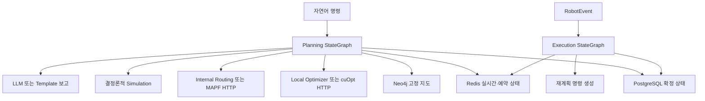
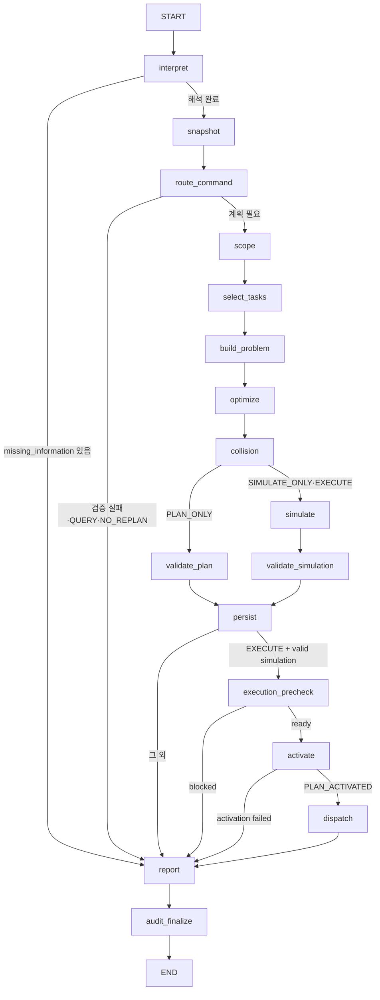
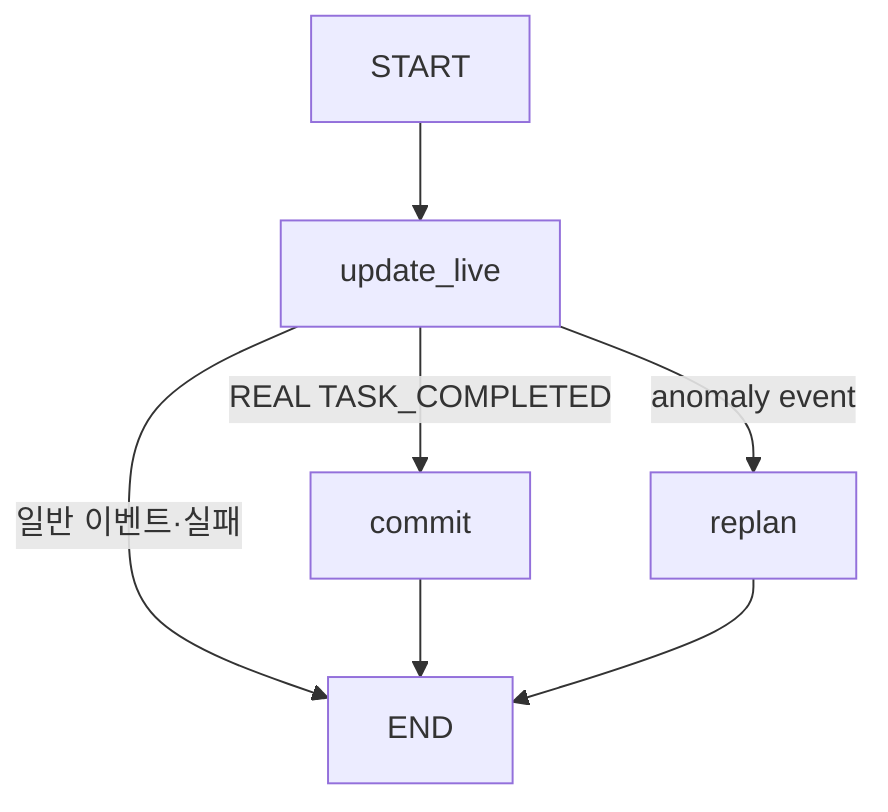

# AI Agent Baseline

## 1. 문서 목적과 기준

이 문서는 `warehouse_langgraph_agent_vscode` 프로젝트를 자연어 기반 창고 운영 멀티에이전트 시스템으로 단계적으로 확장하기 전의 실제 구현 기준선이다.

- 기준일: 2026-07-21
- 기준 테스트: `66 passed, 1 warning`
- 이번 Phase에서 기능 코드는 변경하지 않았다.
- 분석 대상: Planning Graph, Execution Graph, State, 모델, 프롬프트, 서비스, 저장소, API, 마이그레이션, 테스트
- 이후 Phase는 이 문서에 적힌 기존 계약과 결정론적 계산 경계를 보존해야 한다.

## 2. 현재 상위 구조

현재 시스템은 하나의 명시적인 Supervisor Agent가 전체 실행을 지휘하는 구조가 아니다. `app/planning/graph.py`의 고정된 StateGraph가 전체 흐름을 제어하고, 다음 두 지점에서 LLM 기반 Supervisor 성격의 판단을 수행한다.

1. `interpret_command_node`: 자연어를 `CommandInterpretation`으로 구조화
2. `decide_scope_node`: Snapshot 요약을 바탕으로 `ScopeDecision` 생성

로봇 배정, 거리, 시간, 에너지, tardiness, 경로, 충돌 검사는 결정론적 코드가 담당한다.



## 3. Planning Graph 실제 구조

정의 위치: `app/planning/graph.py`

### 3.1 등록된 노드

| Graph 노드 | 실제 함수 | 현재 역할 |
|---|---|---|
| `interpret` | `interpret_command_node` | 자연어 명령 구조화, 단순 조회 규칙 fallback |
| `snapshot` | `build_snapshot_node` | PostgreSQL·Neo4j·Redis 또는 simulation state Snapshot 생성 |
| `route_command` | `route_by_command_node` | QUERY와 계획 명령의 결정론적 분기 |
| `scope` | `decide_scope_node` | LLM 범위 판단 후 운영 규칙으로 보정 |
| `select_tasks` | `select_required_tasks_node` | 기존 work와 신규 OUTBOUND 요청을 AtomicTask로 변환 |
| `build_problem` | `build_optimization_problem_node` | 최적화 입력과 기준 시각·가중치 구성 |
| `optimize` | `optimizer_node` | local 또는 cuOpt 최적화 호출 |
| `collision` | `collision_avoidance_node` | internal 또는 MAPF 경로 생성 |
| `validate_plan` | `validate_plan_node` | PLAN_ONLY 경로·배정 결정론적 검증 |
| `simulate` | `simulation_node` | timeline 포함 시뮬레이션, SIMULATE_ONLY 가상 상태 재생 |
| `validate_simulation` | `validate_simulation_node` | 시뮬레이션 결과의 유효 상태 반영 |
| `persist` | `persist_result_node` | `simulation_run` append-only 저장과 session 갱신 |
| `execution_precheck` | `execution_precheck_node` | 검증된 simulation과 Gateway 설정 확인 |
| `activate` | `activate_plan_node` | Redis 활성 계획 원자적 교체 |
| `dispatch` | `dispatch_plan_node` | Robot Gateway `/dispatch` 전송 |
| `report` | `generate_final_report_node` | 조회 보고 또는 계획 결과 보고 생성 |
| `audit_finalize` | `audit_finalizer_node` | command와 stage 감사 이력 최종 저장 |

`impact_analyzer_node`는 구현되어 있지만 현재 Planning Graph에 등록되거나 edge로 연결되어 있지 않다.

### 3.2 실제 edge와 분기



### 3.3 현재 재계획 상태

- `PlanningState.replan_count` 초기값은 0이다.
- `impact_analyzer_node`는 실패 issue에서 영향을 받은 로봇·작업·노드·time-step을 추출할 수 있다.
- 하지만 Verification 결과를 받아 Optimizer로 되돌아가는 edge가 없다.
- 동일 오류 반복 signature, 최대 재계획 제한, replan history가 없다.
- 같은 command 안에서 자동으로 새 `plan_version`을 생성하며 반복하는 루프는 없다.

따라서 현재 Planning Graph는 단일 통과 파이프라인이며 자동 재계획 루프는 구현되지 않았다.

## 4. Execution Graph 실제 구조

정의 위치: `app/execution/graph.py`



### 4.1 노드 역할

- `update_live_state_node`
  - REAL: 실제 Redis robot/task 상태 갱신
  - SIMULATION: 해당 `simulation_id`의 Redis 가상 상태와 PostgreSQL session checkpoint 갱신
- `commit_completion_node`
  - REAL: PostgreSQL `works`, `warehouse_items`, `robot`, `work_event`를 트랜잭션으로 반영
  - SIMULATION: 실제 업무 테이블을 변경하지 않고 session checkpoint만 저장
- `emit_replan_node`
  - 이상 이벤트에서 `NaturalLanguageCommand(source="SYSTEM_EVENT")` 생성
  - REAL은 `EXECUTE`, SIMULATION은 `SIMULATE_ONLY` 요청으로 생성

### 4.2 현재 anomaly event

```text
ROBOT_DELAYED
ROBOT_FAILED
PATH_BLOCKED
PATH_DEVIATED
```

`handle_robot_event(..., auto_replan=True)`이면 생성된 명령을 `run_planning`에 전달할 수 있다. 그러나 FastAPI `POST /v1/execution/events`는 현재 `auto_replan=False`로 호출하므로 API 경로에서는 자동 계획을 실행하지 않는다.

## 5. 현재 LLM 사용 지점

LLM 생성 함수는 `app/planning/nodes.py`의 `build_supervisor_llm()`이다. 설정은 `OPENAI_API_KEY`, `OPENAI_MODEL`, timeout을 사용하며 기본 모델 설정값은 `gpt-5.4-mini`이다.

| 위치 | 프롬프트 | Structured output | 입력 | fallback |
|---|---|---|---|---|
| `interpret_command_node` | `COMMAND_SUPERVISOR_PROMPT` | `CommandInterpretation` | 자연어 명령 JSON | 단순 조회만 규칙 fallback; 복잡 계획은 missing information과 오류 보고 |
| `decide_scope_node` | `SCOPE_SUPERVISOR_PROMPT` | `ScopeDecision` | 명령 해석, compact Snapshot, 이전 범위, impact, replan count | 독립적인 try/except fallback 없음; LLM 결과를 deterministic 규칙으로 보정 |
| `generate_final_report_node` | `FINAL_REPORT_PROMPT` | `FinalReportOutput` | 정제된 `planning_report_data` | `template_planning_answer` 사용 |

현재 프롬프트 문자열에는 명시적인 버전 상수가 없다. 전체 시스템 프롬프트는 DB에 저장하지 않는다.

### 5.1 LLM이 하지 않는 일

- SQL 또는 Cypher 생성과 실행
- 로봇 후보 평가와 배정
- 최단거리와 이동시간 계산
- tardiness 계산
- 충돌 판정과 시간 경로 생성
- 재고 transition 계산
- 실제 DB·Redis·Neo4j 상태 변경

## 6. Structured output 모델과 요청 모델

정의 위치: `app/models.py`

### 6.1 LLM structured output

- `CommandInterpretation`
  - command kind, intent, query 대상·행동, 품목·수량·노드·마감·우선순위
  - SQL/Graph 읽기 범주
  - 실행 모드, 최적화 가중치, 폐쇄 가정, missing information
- `ScopeDecision`
  - plan mode, 영향·고정·변경 작업/로봇, freeze horizon, 목표, 짧은 근거
- `FinalReportOutput`
  - `answer` 문자열만 포함

### 6.2 결정론적 데이터 모델

- `OptimizationWeights`
- `AtomicTask`
- `ScheduledTask`
- `CuOptPlan`
- `TimedWaypoint`, `TimedRoute`, `CollisionFreePlan`
- `SimulationIssue`, `SimulationResult`
- `InventoryDelta`, `RobotEvent`

### 6.3 현재 자연어 명령 계약

`NaturalLanguageCommand` 필드:

```text
command_id
warehouse_id
text
requested_execution_mode: AUTO | PLAN_ONLY | SIMULATE_ONLY | EXECUTE
simulation_id
received_at
source: USER | SYSTEM_EVENT
```

현재 `conversation_id`, `parent_command_id`, comparison 관련 필드는 요청 모델에 없다.

## 7. 현재 deterministic 처리 지점

### 7.1 Snapshot과 검증

`build_snapshot_node`는 명령 처리마다 `datetime.now(UTC)`를 한 번 호출해 `captured_at`을 고정한다.

- PostgreSQL: inventory, robots, open works
- Neo4j: nodes와 `CONNECTED_TO` edges
- Redis: 실시간 robot/task, active plan, temporary closure
- 같은 `simulation_id`의 후속 SIMULATE_ONLY: 실제 동적 상태 대신 해당 가상 state 사용

`validate_snapshot`은 다음을 검사한다.

- SQL 참조 node가 Neo4j에 존재하는지
- 창고 지도 node와 edge가 존재하는지
- 요청 품목의 가용 재고가 충분한지
- 계획 명령에 사용할 robot 정보가 존재하는지

### 7.2 작업 선별

`select_required_tasks_node`는 다음을 코드로 수행한다.

- 완료 work 제외
- 실행 중 정상 작업과 fixed/freeze 대상 보호
- LOCAL_REPLAN에서 영향받지 않는 작업 frozen 처리
- 기존 work를 AtomicTask로 변환
- 신규 OUTBOUND를 FEFO allocation 기반 PICK/DROP 작업으로 분해

현재 신규 INBOUND LOT 생성은 없다.

### 7.3 최적화 가중치

`resolve_optimization_weights`가 사용자 문장의 명시적 표현만 regex로 판정한다.

기본값:

```text
total_distance = 1.0
makespan = 1.0
tardiness = 5.0
energy = 1.0
robot_activation = 0.5
plan_change = 2.0
```

명시적 기준이 있을 때 해당 가중치만 5배로 높인다. LLM이 반환한 임의 가중치는 최종 optimization problem에 직접 사용하지 않는다.

### 7.4 Local Optimizer

`LocalOptimizer`는 결정론적 greedy insertion 알고리즘이다.

- active Neo4j Snapshot edge로 최단거리·시간 계산
- priority, deadline, task id 순으로 작업 순서 결정
- 배터리·적재량·폐쇄 node/edge·선후관계 검사
- 로봇 ID, source, target을 포함한 안정적인 tie-break
- 기존 계획의 frozen/preserved 작업 유지
- 거리, makespan, tardiness, energy, robot activation, plan change를 목적함수에 반영

현재 `CuOptPlan.metadata`에 저장하는 값은 aggregate 수준이다.

```text
total_distance
makespan_time_steps
tardiness_time_steps
energy
active_robot_count
plan_changes
preserved_task_ids
reference_time
time_step_seconds
```

후보 로봇별 choices는 계산 중 메모리에만 존재하며 반환·저장하지 않는다. 목적함수 component breakdown도 별도 저장하지 않는다.

### 7.5 Optimizer backend fallback

`optimize_problem`은 설정에 따라 local 또는 cuOpt HTTP를 사용한다.

- local: `LocalOptimizer`
- cuOpt: `CuOptHttpOptimizer`
- cuOpt 실패와 `cuopt_fallback_to_local=True`: local로 fallback하고 warning 반환

### 7.6 Routing

내부 `PrioritizedTimeExpandedPlanner`는 다음을 수행한다.

- active node와 edge만 사용
- node·edge 임시 폐쇄 반영
- 시간 확장 최단경로
- vertex reservation
- 반대 방향 edge reservation
- 예약을 피하기 위한 WAIT 후보 포함
- 기존 route와 freeze horizon prefix 보존

현재 반환 근거는 `TimedWaypoint` 배열, route 거리와 aggregate metadata다.

```text
routing_backend
vertex_reservations 개수
edge_reservations 개수
```

현재 route segment, edge identifier, reservation owner, WAIT 원인, blocked-by robot/task, 중간 충돌 후보는 저장하지 않는다.

외부 MAPF 실패와 `mapf_fallback_to_internal=True`이면 내부 planner로 fallback하고 warning을 저장한다.

### 7.7 Simulation과 validation

`simulate_plan`은 Optimizer와 Routing 결과를 결정론적으로 검사한다.

- invalid/closed node
- disconnected/closed edge
- non-monotonic time
- vertex conflict
- edge-swap conflict
- duplicate assignment
- missing route
- unassigned task
- task endpoint 미도달
- precedence 위반
- battery 제약
- inventory 부족
- UTC reference time 기반 tardiness

`validate_plan_node`와 `simulation_node`는 같은 `simulate_plan`을 사용하고, timeline 포함 여부만 다르다. `validate_simulation_node`는 생성된 `SimulationResult.valid`를 상태에 반영한다.

독립적인 Verification Agent와 `VerificationDecision` 모델은 현재 없다.

## 8. 현재 PlanningState와 ExecutionState

### 8.1 PlanningState

```text
command
interpretation
snapshot
validation
scope
required_tasks
optimization_problem
cuopt_plan
collision_plan
plan_validation
simulation
impact
plan_version
simulation_id
simulation_base_state
simulation_current_state
simulation_checkpoint
dispatch_result
execution_ready
replan_count
final_status
response
answer
report_data
errors
warnings
audit_warnings
trace
```

`errors`, `warnings`, `audit_warnings`, `trace`는 reducer로 누적된다.

현재 없는 주요 필드:

```text
supervisor_decision
supervisor_source
supervisor_warnings
verification_decision
replan_attempt
max_replan_attempts
replan_history
repeated_failure_signatures
conversation_id
comparison_id
plan_evidence
route_evidence
```

### 8.2 ExecutionState

```text
event
redis_updated
sql_committed
replan_command
commit_result
stream_id
simulation_current_state
final_status
errors
```

## 9. 저장소와 상태 저장 구조

### 9.1 PostgreSQL

`PostgresRepository`의 주요 역할:

- inventory, robot, open works Snapshot
- command history와 stage log
- simulation session 조회
- simulation run append-only 저장
- REAL TASK_COMPLETED 트랜잭션 반영
- simulation checkpoint 갱신
- simulation reset과 audit

`simulation_run`은 실행 이력이고 매 실행마다 새 `run_id`로 INSERT한다. `simulation_session`은 최신 base/current state와 checkpoint를 보관한다.

### 9.2 Redis

실제 운영 상태:

```text
wh:{warehouse_id}:robots
wh:{warehouse_id}:robot:{robot_id}
wh:{warehouse_id}:tasks:executing
wh:{warehouse_id}:tasks:planned
wh:{warehouse_id}:active_plan_version
wh:{warehouse_id}:plan:{plan_version}
```

가상 시뮬레이션 상태:

```text
sim:{simulation_id}:inventory
sim:{simulation_id}:robots
sim:{simulation_id}:works
sim:{simulation_id}:events
wh:{warehouse_id}:simulations
```

실제 계획 활성화는 Lua script로 expected active version을 비교한 후 원자적으로 처리한다.

### 9.3 Neo4j

- `Warehouse` → `HAS_ZONE` → `Zone` → `HAS_NODE` → `MapNode`
- `MapNode` 간 `CONNECTED_TO`
- 읽는 edge 속성: `distance`, `travel_seconds`, `direction`, `width`, `active`
- 로봇의 현재 위치나 실시간 예약은 Neo4j에 저장하지 않는다.

## 10. command_history와 planning_stage_log

마이그레이션: `migrations/003_command_history.sql`

### 10.1 command_history

명령 단위로 다음을 저장한다.

- command ID, warehouse, command type
- 요청·확정 실행 모드
- source, 원문, actor
- status, simulation ID, plan version
- received/completed time
- compact result/error summary

현재 conversation, comparison, triggering event, prompt version, model name, LLM/fallback 여부 전용 컬럼은 없다.

### 10.2 planning_stage_log

`AuditService`가 최종 state의 trace를 stage row로 변환한다.

- `(command_id, sequence, attempt)` unique
- trace 세부정보를 sanitize한 뒤 JSONB 저장
- API key, password, DB/Redis URL, token 등은 redaction
- 감사 저장 실패는 `audit_warnings`로 분리하며 성공한 본 작업을 실패로 바꾸지 않는다.

현재 stage 이름은 `TRACE_STAGE_NAMES` 매핑을 사용한다. Supervisor·Verification·Replan 전용 stage는 아직 없다.

## 11. 시뮬레이션 상태와 실행 격리

### 11.1 SIMULATE_ONLY

- 실제 Snapshot으로 base state 생성
- simulation ID 전용 Redis 상태에 timeline 재생
- actual Redis robot state를 변경하지 않음
- actual PostgreSQL inventory/work를 변경하지 않음
- `simulation_session` current state와 checkpoint 갱신
- `simulation_run` append-only 이력 저장

### 11.2 EXECUTE와 REAL event

- 유효한 simulation 결과와 `ROBOT_GATEWAY_URL`이 있어야 activation 가능
- Redis active plan을 원자적으로 교체한 뒤 Gateway에 전송
- REAL `TASK_COMPLETED`에서 PostgreSQL 작업·재고·로봇·이벤트를 트랜잭션 반영
- 공통 inventory transition 함수를 REAL과 SIMULATION이 공유

## 12. RobotEvent 계약

현재 event type:

```text
POSITION_UPDATED
TASK_STARTED
TASK_COMPLETED
ROBOT_DELAYED
ROBOT_FAILED
PATH_BLOCKED
PATH_DEVIATED
```

컨텍스트 규칙:

- REAL: `simulation_id`는 null이어야 함
- SIMULATION: `simulation_id` 필수
- REAL TASK_COMPLETED: `work_id` 필수
- SIMULATION TASK_COMPLETED: `work_id` 또는 `task_id` 필수

event ID가 기본 생성되고 REAL 완료 반영은 `work_event.event_id`로 idempotency를 확인한다.

## 13. 현재 API 목록

| Method | Path | 역할 |
|---|---|---|
| GET | `/health` | 설정·저장소 연결 확인 |
| POST | `/v1/planning/commands` | 자연어 명령 실행 |
| GET | `/v1/commands` | 명령 이력 목록 |
| GET | `/v1/commands/{command_id}` | 명령 상세 |
| GET | `/v1/commands/{command_id}/stages` | 단계 로그 |
| POST | `/v1/execution/events` | RobotEvent 처리 |
| POST | `/v1/simulations/{simulation_id}/reset` | 단일 가상 세션 초기화 |
| POST | `/v1/warehouses/{warehouse_id}/simulations/reset-all` | 창고의 가상 세션 전체 초기화 |
| GET | `/v1/simulations` | 세션 목록 |
| GET | `/v1/simulations/{simulation_id}` | 세션 요약 |
| GET | `/v1/simulations/{simulation_id}/state` | 전체 base/current state |
| GET | `/v1/simulations/{simulation_id}/runs` | append-only run 이력 |
| GET | `/v1/simulations/{simulation_id}/logs` | 관련 command/stage/reset 로그 |
| GET | `/v1/warehouses/{warehouse_id}/simulation-reset-logs` | 창고 reset audit |

현재 plan evidence, verification, conversation, scenario comparison, replan 조회 API는 없다.

## 14. 현재 보고서 구조

`planning_report_data`는 다음 실제 결과를 정제한다.

- execution/plan mode
- valid
- task/robot count
- task assignment와 robot task order
- route별 distance와 waypoint count
- total distance
- makespan steps/seconds
- tardiness
- conflict count
- errors/warnings

LLM에는 이 정제된 data만 전달하며 원본 전체 Snapshot을 전달하지 않는다. LLM 실패 또는 비활성화 시 template 보고를 사용한다.

현재 보고서는 후보 로봇 탈락 이유, 목적함수 component, route segment, WAIT 원인, reservation owner, Optimizer/Route 거리 비교, Verification과 replan history를 포함하지 않는다.

## 15. 현재 fallback 구조

| 대상 | fallback |
|---|---|
| 단순 QUERY 해석 | regex 기반 `rule_based_query_interpretation` |
| 복잡 계획 해석 | 안전한 실패와 missing information 보고 |
| scope LLM | 명시적 fallback 없음; 결과 후 deterministic 보정만 있음 |
| 최종 보고 LLM | deterministic template |
| cuOpt | 설정 시 Local Optimizer |
| 외부 MAPF | 설정 시 internal routing |
| 감사 저장 | 본 처리 유지, audit warning 추가 |

## 16. 테스트 기준선

실행 명령:

```powershell
python -m compileall -q app tests
python -m pytest -q
```

결과:

```text
compileall: success
pytest: 66 passed, 1 warning in 12.16s
```

warning은 Starlette `TestClient`가 기존 `httpx` 통합을 사용하는 데 대한 deprecation warning이다.

현재 테스트 분포:

| 파일 | 테스트 수 |
|---|---:|
| `test_audit.py` | 2 |
| `test_command_history_api.py` | 4 |
| `test_execution_contexts.py` | 6 |
| `test_local_optimizer.py` | 5 |
| `test_mock_robot_gateway.py` | 5 |
| `test_models.py` | 2 |
| `test_pipeline.py` | 14 |
| `test_planning_modes.py` | 6 |
| `test_routing.py` | 4 |
| `test_simulation_reset.py` | 9 |
| `test_tardiness.py` | 6 |

테스트는 Fake Repository와 `monkeypatch`, FastAPI `TestClient`를 주로 사용하며, pipeline 테스트는 fake LLM structured output을 주입한다.

## 17. 향후 Phase별 변경 대상

### Phase 2: Explicit Supervisor

- `SupervisorDecision` 모델
- 명시적 `supervisor_node`
- 안전한 deterministic supervisor fallback
- 프롬프트 버전 상수
- Supervisor trace와 audit stage

### Phase 3: Verification Agent

- `VerificationDecision` 모델
- deterministic validation을 우선하는 verification node
- evidence ID 기반 입력과 fallback

### Phase 4: Replan Loop

- 현재 미연결 `impact_analyzer_node` 통합
- LOCAL/GLOBAL loop edge
- attempt, history, repeated signature, limit
- frozen/preserved route 보호 검증

### Phase 5: Optimization Evidence

- Local Optimizer의 실제 후보 choices 구조화
- feasible=false 원인
- 실제 tie-break
- objective component 합계

기존 choices 생성·정렬 순서를 변경하지 않고 evidence만 수집해야 한다.

### Phase 6: Route Evidence

- waypoint 기반 실제 segment 생성
- Snapshot edge 식별자
- reservation owner와 WAIT 원인
- preserved/new route 구분
- Optimizer/Route 거리 차이

기존 path 선택 결과를 변경하지 않고 evidence를 추가해야 한다.

### Phase 7: Evidence Report

- 정제된 report evidence 모델
- 숫자와 이유의 source 보장
- 확인 불가능 항목 명시

### Phase 8 이후

- intent 확장과 50개 이상 자연어 분류 테스트
- structured clarification
- conversation context
- What-if comparison
- event-driven safe replan

## 18. 변경하지 않을 기존 계약

다음 계약은 이후 Phase에서도 하위 호환을 유지한다.

1. 기존 FastAPI path와 기존 요청·응답 필드를 삭제하거나 이름을 바꾸지 않는다.
2. `PLAN_ONLY`, `SIMULATE_ONLY`, `EXECUTE`, `AUTO` 의미를 유지한다.
3. QUERY는 Optimizer, Routing, Simulation을 호출하지 않는다.
4. EXECUTE는 유효한 Simulation과 precheck 없이 activation·dispatch하지 않는다.
5. Local Optimizer의 현재 배정과 deterministic tie-break를 evidence 추가 때문에 변경하지 않는다.
6. Internal Routing의 현재 경로 선택과 reservation 결과를 evidence 추가 때문에 변경하지 않는다.
7. UTC 기준 `captured_at`과 tardiness 계산을 유지한다.
8. REAL과 SIMULATION 상태 격리를 유지한다.
9. `simulation_run` append-only와 `simulation_session` base/current 분리를 유지한다.
10. simulation reset은 실제 운영 상태와 활성 실행 계획을 변경하지 않는다.
11. 감사 로그 실패가 성공한 본 작업을 무조건 실패시키지 않는 정책을 유지한다.
12. LLM은 계산 결과나 존재하지 않는 사실을 생성하지 않고 해석·선택·종합·설명에만 사용한다.

## 19. 현재 확인된 주요 설계 간극

- 명시적인 `supervisor_node`와 통합 Supervisor decision이 없다.
- Scope LLM 실패에 대한 deterministic fallback이 없다.
- 독립 Verification Agent가 없다.
- deterministic validation 실패 후 자동 replan edge가 없다.
- Execution API는 anomaly event에서도 자동 재계획을 실행하지 않는다.
- 최적화 후보와 목적함수 component evidence가 없다.
- route segment와 WAIT/reservation 원인 evidence가 없다.
- 보고서는 aggregate 결과 중심이다.
- clarification은 `missing_information` 문자열과 조기 보고 수준이며 대화형 구조가 아니다.
- conversation과 scenario comparison 저장 모델·API가 없다.
- prompt version, model name, LLM/fallback 여부를 감사 구조에 명시적으로 저장하지 않는다.

이 간극들이 이후 Phase의 구현 대상이며, Phase 2 전에는 기능 코드 변경을 시작하지 않는다.
