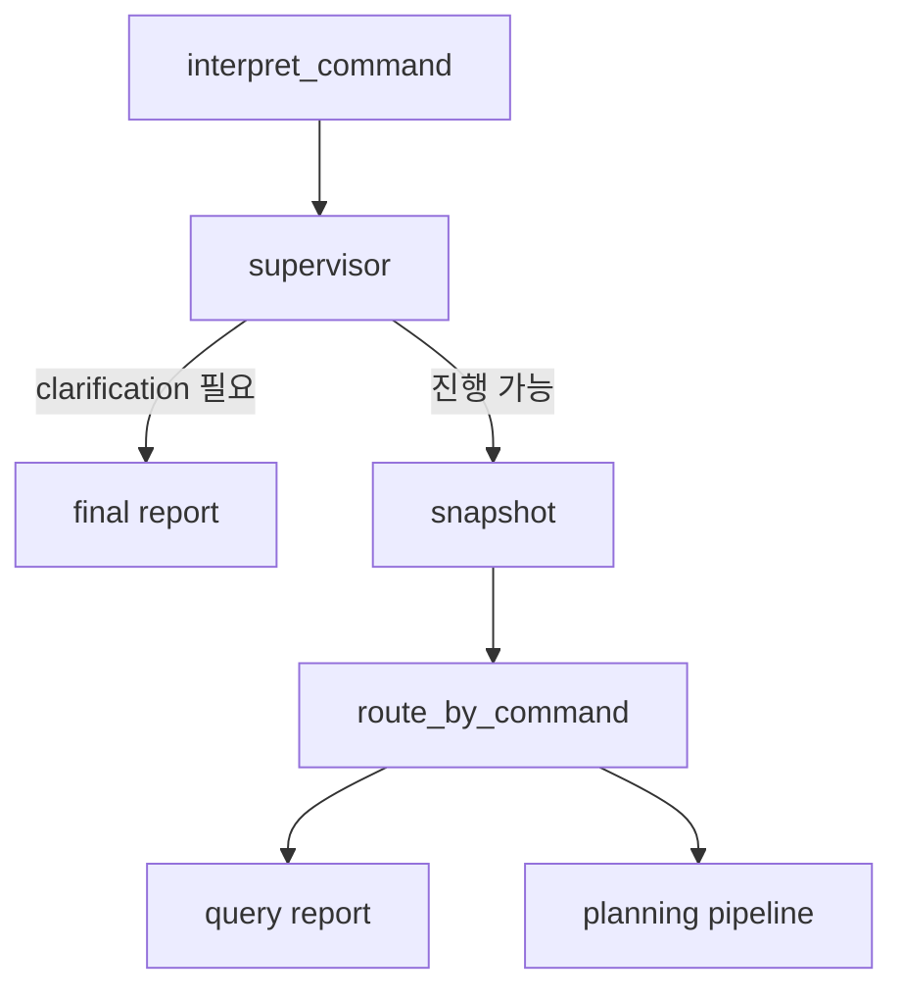

# Explicit Supervisor Agent

## 목적

Supervisor Agent는 Command Interpreter의 구조화 결과를 검토하고 창고 계획 파이프라인에서 어떤 도구와 실행 범위를 사용할지 결정한다. 로봇 배정, 거리, 시간, 에너지, tardiness, 경로와 충돌은 계산하지 않는다.

- 프롬프트 버전: `supervisor_v1`
- 프롬프트 위치: `app/prompts.py`
- 노드 위치: `app/planning/nodes.py::supervisor_node`
- 출력 모델: `app/models.py::SupervisorDecision`

## Graph 위치



이번 Phase에서는 별도 Clarification API를 만들지 않는다. 필수 정보가 부족하면 기존 보고 경로로 안전하게 종료하며 Optimizer, Routing, Simulation, Execution을 호출하지 않는다.

## SupervisorDecision

```text
intent
command_kind: QUERY | PLAN | EXECUTE
execution_mode: PLAN_ONLY | SIMULATE_ONLY | EXECUTE
required_tools
plan_mode
requires_clarification
clarification_reason
risk_level: LOW | MEDIUM | HIGH
allow_replan
max_replan_attempts
next_node: SNAPSHOT | REPORT
reasoning_summary
```

`reasoning_summary`는 짧은 결정 근거이며 내부 chain-of-thought를 저장하지 않는다.

## 허용 도구

Supervisor가 선택할 수 있는 도구는 다음 여섯 개로 제한된다.

```text
SNAPSHOT
OPTIMIZER
ROUTING
SIMULATION
VERIFICATION
EXECUTION
```

Pydantic Literal과 결정론적 정규화를 함께 사용하므로 LLM이 존재하지 않는 도구를 추가할 수 없다.

실행 모드별 필수 도구:

| 모드 | 도구 |
|---|---|
| QUERY | SNAPSHOT |
| PLAN_ONLY | SNAPSHOT, OPTIMIZER, ROUTING, VERIFICATION |
| SIMULATE_ONLY | SNAPSHOT, OPTIMIZER, ROUTING, SIMULATION, VERIFICATION |
| EXECUTE | SNAPSHOT, OPTIMIZER, ROUTING, SIMULATION, VERIFICATION, EXECUTION |

독립 Verification Agent는 `validate_plan_node` 또는 `validate_simulation_node`의
결정론적 결과 뒤에서 실행된다. 상세한 안전 경계와 저장 형식은
`docs/verification_agent.md`를 참고한다.

## 안전 보정

LLM 출력은 `normalize_supervisor_decision()`에서 다음 규칙으로 보정한다.

1. intent는 검증된 `CommandInterpretation` 값을 사용한다.
2. 사용자가 명시한 실행 모드와 QUERY 안전 규칙을 우선한다.
3. LLM이 EXECUTE 필수 도구를 누락해도 전체 안전 도구를 강제로 적용한다.
4. QUERY는 PLAN_ONLY, NO_REPLAN, SNAPSHOT-only로 고정한다.
5. `missing_information`은 LLM이 무시할 수 없으며 clarification으로 전환한다.
6. EXECUTE 위험 수준은 HIGH보다 낮출 수 없다.
7. 설정과 관계없이 재계획 최대치는 3회를 넘을 수 없다.
8. QUERY와 clarification 상태에서는 재계획을 허용하지 않는다.
9. PLAN/EXECUTE 명령은 NO_REPLAN으로 우회할 수 없다.

이 보정은 배정이나 경로 결과를 만들지 않고 실행 제어 정보만 다룬다.

## Deterministic fallback

다음 경우 `deterministic_supervisor_decision()`을 사용한다.

- `OPENAI_API_KEY`가 없음
- LLM 호출 실패
- structured output 검증 실패

fallback은 `CommandInterpretation`만 사용해 도구·위험·범위를 선택한다. 창고 데이터나 계산값을 추정하지 않는다.

`supervisor_source` 값:

```text
llm
deterministic_fallback
```

## Scope 처리

Supervisor는 Snapshot 전 명령 의미를 기준으로 provisional `plan_mode`를 반환한다. Snapshot 후 `decide_scope_node`가 실제 활성 계획과 실패 로봇을 확인해 다음과 같이 결정론적으로 보정한다.

- 기존 계획 없음: `INITIAL_PLAN`
- 기존 계획이 있는데 전체 신규 계획: `GLOBAL_REPLAN`
- 신규 작업 추가: `INSERT_TASK`
- 특정 장애·작업: `LOCAL_REPLAN`
- QUERY: `NO_REPLAN`

기존 함수를 직접 호출하는 코드와 테스트를 위해 `supervisor_decision`이 없는 경우의 기존 Scope LLM 경로도 하위 호환용으로 유지한다.

## 감사와 관측성

planning stage에 다음 단계가 저장된다.

```text
SUPERVISOR_STARTED
SUPERVISOR_FALLBACK_USED
SUPERVISOR_COMPLETED
```

성공한 LLM 경로에는 STARTED와 COMPLETED가, fallback 경로에는 세 단계가 모두 남는다.

저장하는 정보:

- prompt version
- model name
- LLM 활성 여부
- source와 fallback 여부
- command/execution/plan mode
- required tools
- risk level
- clarification 여부
- 재계획 허용과 최대 횟수
- 짧은 reasoning summary

API key, 전체 프롬프트, 원시 Snapshot, chain-of-thought는 저장하지 않는다. `simulation_run.output_payload`와 command result summary에도 compact Supervisor 결정이 연결된다.

## 기존 계약 유지

- 기존 API path와 요청 필드는 변경하지 않았다.
- 기존 응답 필드는 유지하고 Supervisor 관련 필드만 추가했다.
- Local Optimizer, cuOpt, Routing, Simulation 계산은 변경하지 않았다.
- QUERY의 조기 종료를 유지했다.
- EXECUTE는 Simulation과 deterministic validation을 통과해야 한다.
- REAL/SIMULATION 상태 격리와 reset 동작은 변경하지 않았다.

## 다음 Phase와의 경계

이번 구현에는 다음 기능을 포함하지 않는다.

- 독립 Verification Agent
- 자동 재계획 Graph loop
- 후보 로봇별 evidence
- route segment와 WAIT 원인 evidence
- 대화형 Clarification API
- conversation context
- What-if 비교
- 이벤트 기반 자동 재계획 실행
